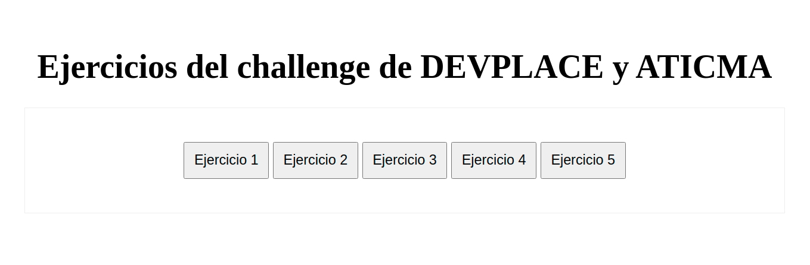

# Challenge JavaScript



Presionar los botones según el ejercicio que se quiera revisar.

En caso de revisar el código fuente, cada ejercicio se compone de:

* `Ejercicio1`: devuelve la cantidad de mayúsculas que hay en la **cadena**
  ```
  CantidadMayusculas(cadena)
  ```

* `Ejercicio2`: devuelve cada elemento dentro de **lista** sumado mas 1
  ```
  ejerciciodos(lista = [1,2,3,4,5,7])
  ```

* `Ejercicio3`: devuelve **n** números al azar pedidos al usuario mediante un **prompt**
  ```
  ejerciciotres(n = 10)
  ```

* `Ejercicio4`: devuelve la **lista** pasada, ordenada de menor a mayor
  ```
  ejerciciocuatro(lista = [])
  ```

* `Ejercicio5`: devuelve la unión de **v1** y **v2**, de forma ordenada y sin repetir
  ```
  ejerciciocinco(v1 = [1,2,4,6,7,8], v2 = [1,2,4,5,6,7,8])
  ```

En todos los casos, los resultados de cada `Ejercicio` se mostrarán mediante un **alert** si son ejecutados desde el archivo **index.html**.
